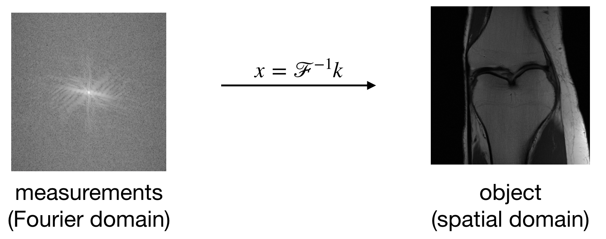
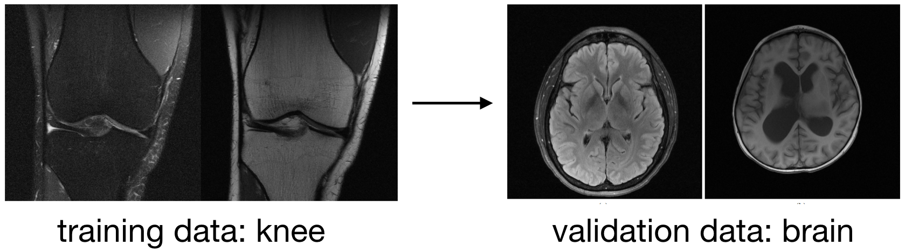
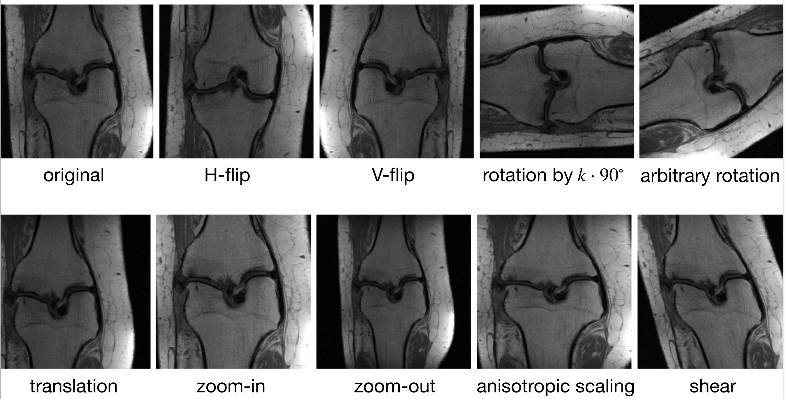
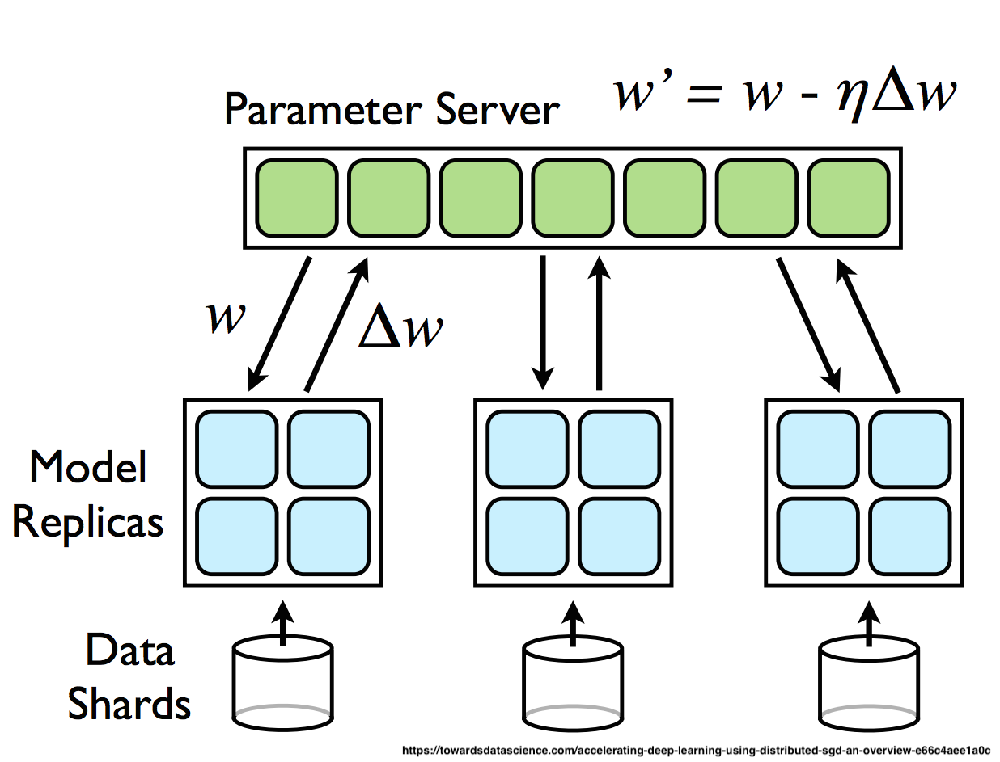

# Transfer learning for MRI
This project investigates data augmentation as a tool to improve the robustness and transferability of deep learning models for MRI reconstruction.

## Deep learning and MRI
Recently, deep learning based methods emerged as powerful techniques to reconstruct MRI volumes from noisy and undersampled measurements produced by the MR scanner.

Despite the success of neural networks in medical image reconstruction, collecting enough training data remains a challenge in this domain.

There are several factors making data collection challenging in medical applications, such as:
- the cost of the instrument and its operation
- long acquisition time
- patient confidentiality
- potential health concerns (ionizing radiation, enclosed space...)

## Transfer learning
It is common in practice that we have access to a large labelled source dataset that can be used for training efficient deep learning models, however we want to apply this model to other tasks we have few or no training data for. This problem in machine learning is called *transfer learning*.

In the context of MRI, we might have access to fully sampled scans of a certain anatomy (such as knee MRI images). As we have seen before, collecting new measurements of other anatomies, especially on the scale needed for deep learning, can be challenging.

In this project I investigate how would a network trained on a large *knee* MRI dataset, the [fastMRI dataset](https://fastmri.org/dataset/),  performs on reconstructing *brain* MRI images it has never seen. I apply a data augmentation technique to increase the robustness of the model, and investigate its effect on transfer learning.

## Data augmentation
Data augmentation is a common technique to enlarge the training dataset of images by applying a set of random transformations to the available images, such as horizontal and vertical flips, rotations, cropping and more.

Data augmentation provides a regularizing effect in training by preventing overfitting to the potentially small training dataset and enforcing spatial invariances of natural images.

## Computational requirements of deep learning for MRI
The few available large-scale MRI datasets are in the *terabyte* regime. Moreover, state-of-the-art models have 30-100 million trainable parameters. It is not surprising that training deep learning models for MRI reconstruction is computationally demanding.

Fortunately, computation can be parallelized easily for deep learning using data parallelism. In data parallel training the same model is loaded on several nodes and the output is computed on different batches of data in parallel. Using this training paradigm one can achieve a speedup close to linear.

Specifically in this project, training [the state-of-the-art model](https://arxiv.org/abs/2004.06688) on the fastMRI knee dataset takes about 1200 GPU hours, or *50 days* on a single GPU. Moreover, due to the large models and the activations needed to be saved for backpropagation, each GPU needs at least 16GB memory for knee and at least 24GB memory for brain data.

## Desired outcome of the project
As part of this project, I am going to train two deep learning models using multiple GPUs:
- a [VarNet](https://github.com/facebookresearch/fastMRI/tree/master/fastmri_examples/varnet) model on fastMRI knee data, using no extra tricks
- the same model on the same dataset, but applying a special data augmentation technique tailored to MRI reconstruction (under peer review currently) during training.

Both models will be validated on brain MRI data from the fastMRI dataset. Ideally, I want to demonstrate that the model trained with data augmentation performs better on the unseen brain dataset than the vanilla model. Training curves comparing the two experiments will be submitted as part of the final project. Full source code cannot be shared at this time, since some of the applied techniques are under peer review.

## Software
- **ML codebase:** PyTorch
- **Distributed training:** PyTorch Distributed Data Parallel (DDP) with NCCL backend
- **Wrapper:** [PyTorch Lightning](https://github.com/PyTorchLightning/pytorch-lightning)

## Computational resources
The experiments have been performed on the Discovery cluster at USC on 8xV100 GPUs.

## Experimental results
After training two models on knee MRI data with and without data augmentation, I evaluated both networks on brain MRI images the networks have never seen during training. The comparison is based on Structural Similarity Index Measure, a popular metric measuring similarity between images that better correlates with the human visual perception of similarity than many other metrics (such as MSE or PSNR).

 The experiments indeed verified that data augmentation improves the robustness of the trained deep learning model against shifts in test distribution. In other words, the neural network trained on augmented data provided higher quality reconstructions on unseen data than the model trained using only the original train dataset.

This important experiment hints at the usefulness of data augmentation not only for deep learning on limited data, but also for deploying models on completely new, previously unseen datasets.
